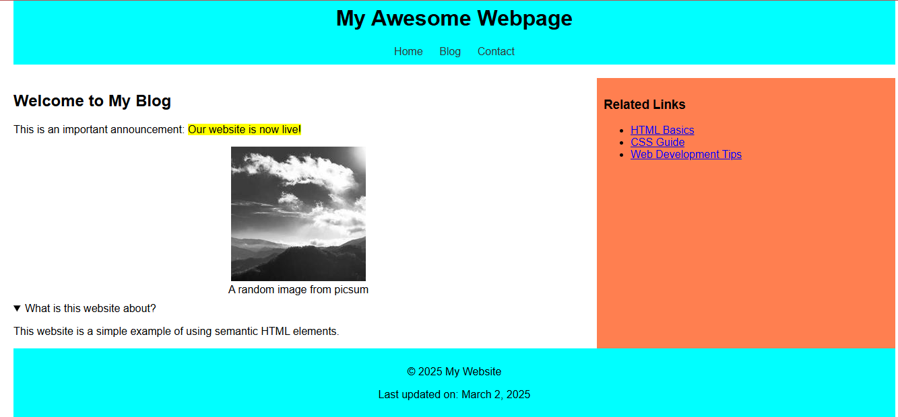

# Lab: Rare Elements

## 📖 intro

We have gone over elements like `
` and others. These are common elements that you would come across in a normal HTML development case. There are others like `<section>`, `<article>` which are used like a div but in nuanced cases.

`<section>`: The `<section>` element defines a standalone part of a document, usually with a heading.

`<article>`: The `<article>` element represents a self-contained, reusable content piece, like a blog post, news article, or user comment.

## 🤔 Why would you need these two elements when you have `
`?

You need `<section>` and `<article>` instead of just `
` because they give meaning to the content. While `
` is just a box with no specific meaning, `<section>` and `<article>` help organize the content in a way that is easier for both people and search engines to understand.

## 🔎 Semantic HTML Elements

Like `<section>` and `<article>`, there are other elements designed for specific purposes in a webpage. These elements add meaning to the content and improve readability for both users and search engines.

1. `<header>`: It is used to define a section's heading, typically containing a title, logo, or navigation links.
   
2. `<footer>`: It represents the bottom section of a page or section, often containing copyright information, links, or contact details.

3. `<aside>`: It is used for content that is related to the main content but not essential, such as sidebars, advertisements, or related links.

4. `<nav>`: It is used specifically for navigation menus or links that help users move around a website.

5. `
`: Provides a summary or toggleable label for the `
` element.

6. `<figure>`: Groups media content like images, illustrations, or code snippets.

7. `<figcaption>`: Provides a caption for the `<figure>` element.

8. `<mark>`: Highlights text for emphasis or reference.

9. `<time>`: Represents a date/time, useful for events, timestamps, or scheduling.

## 💡 Mini Challenge: Build a Structured Webpage!

Use the elements below to create a simple webpage that includes:

✅ A header with a site title and navigation menu.

✅ A main sect on with a highlighted (`<mark>`) announcement.

✅ An article or content area with an image inside a `<figure>` with a `<figcaption>`. For the image you can use this, `"https://picsum.photos/200"`

✅ A sidebar (`<aside>`) with extra links or ads.

✅ A footer with contact info and a timestamp using `<time>`.

✅ A collapsible FAQ section using `
` and `
`.

The end result will look something like:  

